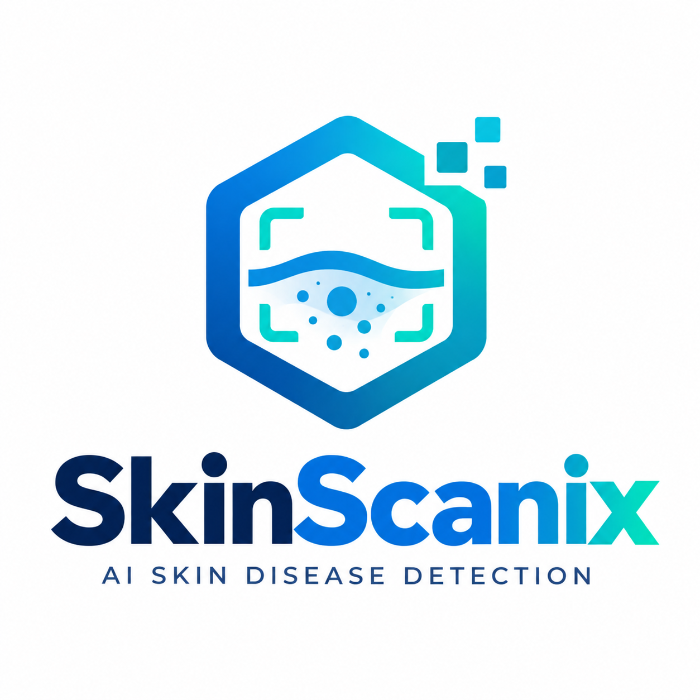

<p align="center">
  
</p>

<h1 align="center">SkinScanix</h1>

<p align="center">
  <strong>AI-assisted skin image analysis, explained simply.</strong><br>
  Upload a photo. Explore the model's assessment. Save a clear PDF report.
</p>

<p align="center">
  <a href="https://ai-skin-disease-detection-system.onrender.com/"><strong>Try the live demo ↗</strong></a>
  &nbsp; · &nbsp;
  <a href="#7-local-installation">Run locally</a>
  &nbsp; · &nbsp;
  <a href="#4-end-to-end-architecture">How it works</a>
  &nbsp; · &nbsp;
  <a href="#20-remaining-work-and-roadmap">Roadmap</a>
</p>

<p align="center">
  
  
  
  
</p>

> **Important:** This is a college-project and research prototype, **not a medical diagnostic device**. Results can be wrong, even when confidence is high. Do not use the app to choose treatment or delay professional care.

## Meet SkinScanix

**In one sentence:** SkinScanix lets you upload a skin photograph, see which supported condition an AI model thinks it resembles, and download the result as a report.

You do not need to understand programming to try it. Open the demo on a phone or computer, choose an image you have permission to use, and select **Analyze image**. The result may be a possible condition, an uncertain answer, or a request for a suitable skin image—not a confirmed diagnosis.

The project brings together a website, image-analysis models, PDF reports and an optional Raspberry Pi camera workflow. **Acne is a development priority**, alongside other common skin conditions and selected lesion categories.

### Your first visit

| 1 · Add a photo | 2 · Review the assessment | 3 · Keep the report |
|---|---|---|
| Upload a clear image or use supported camera controls. | Read the model output, its confidence and the image-quality notes. | Download a branded PDF; optionally submit feedback with consent. |

The first visit to the Render demo may be slow while the server wakes up. Use a **non-sensitive demonstration image** when exploring the public site.

### What makes up the project?

| Feature | In everyday language | Available today? |
|---|---|---|
| **Photo analysis** | Software compares image patterns with patterns learned during training. | Yes, with important accuracy limitations |
| **Skin-image screening** | A first check tries to reject documents, objects and unrelated pictures. | Yes; it can also reject genuine skin incorrectly |
| **Clear results** | A mobile-friendly interface explains the output and image quality. | Yes, with light and dark themes |
| **PDF report** | Save the image and assessment in a readable document. | Yes; standard reports fit one A4 page |
| **Feedback** | Tell the project when an answer seems wrong, for later human review. | Collection works; automatic learning is paused |
| **Pi camera** | A small computer photographs the skin and sends the image to a server. | Client code exists; physical end-to-end testing remains |
| **Installable phone app** | Open SkinScanix from a phone's home screen like an app. | Proposed PWA improvement; not implemented in this release |

### Choose your reading path

| I am here to… | Start here |
|---|---|
| **Understand or demonstrate the project** | [Purpose](#1-purpose-and-scope) → [Using the website](#8-using-the-website-and-pdf-report) → [What's finished](#2-current-status) |
| **Review the college project** | [Architecture](#4-end-to-end-architecture) → [Hardware](#10-raspberry-pi-hardware-integration) → [Measured results](#14-evaluation-and-known-results) |
| **Run or develop the code** | [Local setup](#7-local-installation) → [Repository guide](#6-repository-guide) → [API](#9-api-integration) → [Tests](#18-testing-and-troubleshooting) |
| **Improve the models** | [Datasets](#12-datasets-and-labeling) → [Training](#13-training-and-model-promotion) → [Evaluation](#14-evaluation-and-known-results) |

### Common questions, simple answers

**Does it detect every skin disease?**

No. Two separate classifiers contain 11 condition names between them. That is a list of possible labels, **not proof of reliable detection of all 11 conditions**. [See the scope](#3-supported-condition-labels).

**Does “95% confidence” mean a 95% chance that I have that disease?**

No. It is the model's score, not a medically validated probability. A confident model can still be wrong.

**Does submitting a correction instantly improve the AI?**

No. Feedback is saved for review. Updating a model requires reviewed examples, separate training and testing before release.

**Is a Raspberry Pi or a separate display required to use the website?**

No. The website works in a phone or computer browser. The optional Pi is a camera/uploader; it does not need its own display or run the disease model in the proposed server-based setup.

**Is this already trained specifically for Maharashtra?**

No. India/Maharashtra is an intended focus. Consented, expert-labeled local data and independent evaluation are still needed.

<details>
<summary><strong>New to technology? A quick glossary</strong></summary>

| Term | Simple meaning |
|---|---|
| AI model / classifier | Software trained to assign an image to one of its known categories |
| Dataset / label | A collection of examples / the category attached to each example |
| Training | Learning patterns from labeled examples |
| Inference | Using a trained model to assess a new image |
| Skin gate | A first-pass check for skin versus unrelated images |
| Server / backend | The computer and software that process uploads behind the website |
| API | A defined way for one program, such as the Pi client, to talk to another |
| TFLite / LiteRT | A compact model format / runtime used to execute those models |
| Validation / test set | Separate examples used to check a model; a final test should stay untouched during development |
| Deployment | Publishing a particular application version to a running service |
| PWA | An installable web app; a possible future mobile option for SkinScanix |

</details>

---

## Complete project guide

The sections below cover the project from setup to deployment, including what is implemented, what remains experimental, and what still needs work.

**Documentation review:** 25 September 2026. Older guides retain earlier milestones; use this README and the active source for current behavior. The dates and measurements below are evidence from specific checks, not continuously updated health or accuracy guarantees.

<details>
<summary><strong>Browse all 21 sections</strong></summary>

- [1. Purpose and scope](#1-purpose-and-scope)
- [2. Current status](#2-current-status)
- [3. Supported condition labels](#3-supported-condition-labels)
- [4. End-to-end architecture](#4-end-to-end-architecture)
- [5. Technology stack](#5-technology-stack)
- [6. Repository guide](#6-repository-guide)
- [7. Local installation](#7-local-installation)
- [8. Using the website and PDF report](#8-using-the-website-and-pdf-report)
- [9. API integration](#9-api-integration)
- [10. Raspberry Pi hardware integration](#10-raspberry-pi-hardware-integration)
- [11. Models and inference behavior](#11-models-and-inference-behavior)
- [12. Datasets and labeling](#12-datasets-and-labeling)
- [13. Training and model promotion](#13-training-and-model-promotion)
- [14. Evaluation and known results](#14-evaluation-and-known-results)
- [15. Feedback and storage](#15-feedback-and-storage)
- [16. Configuration](#16-configuration)
- [17. Deployment](#17-deployment)
- [18. Testing and troubleshooting](#18-testing-and-troubleshooting)
- [19. Privacy, security, and responsible use](#19-privacy-security-and-responsible-use)
- [20. Remaining work and roadmap](#20-remaining-work-and-roadmap)
- [21. Contributing, references, and licensing](#21-contributing-references-and-licensing)

</details>

## 1. Purpose and scope

SkinScanix demonstrates how a photograph can move through image checks, machine-learning inference, a web interface, and a downloadable report. The intended future hardware setup uses a Raspberry Pi as a camera and uploader, with results viewed on a phone or computer.

The project aims to make an educational skin-image assessment workflow easy to demonstrate. **Acne is a development priority**, but the project also includes other common-condition and lesion models. It does not detect every skin disease, and its current results are not sufficiently validated for clinical decisions.

The intended regional focus is India, especially Maharashtra/Mumbai. **The current models are not validated specifically for that population.** A regional claim requires appropriately consented, expert-labeled local data and separate evaluation across skin tones, cameras, and clinical settings.

### What the project does

- Accepts an image through an upload, supported browser camera controls, or the separate Flask API.
- Measures image sharpness and brightness.
- Applies skin/non-skin screening and condition-classification logic.
- Shows a model assessment or an uncertain/non-skin result.
- Generates a branded PDF with the image, results, quality information, and limitations.
- Collects optional image feedback with consent in the Gradio interface.

### What it does not establish

- A medical diagnosis, treatment plan, or calibrated probability of disease.
- Reliable classification of all 11 labels on arbitrary phone photographs.
- A validated healthy-skin detector or Maharashtra-specific model.
- Safe automatic learning from every user's correction.
- A completed Raspberry Pi-to-live-website integration.

## 2. Current status

| Area | Current implementation and evidence |
|---|---|
| Branding and UI | SkinScanix logo, responsive layout, light/dark themes, compact Settings and API panels |
| Live website | Render deployment succeeded on 25 September 2026; public SkinScanix page verified |
| GitHub application release | Deployed code commit `0e43aee`, including release `7352c64` |
| Main classifier | Pinned four-condition SCIN TFLite baseline |
| Legacy classifier | Separate seven-label lesion fallback; not a unified 11-class model |
| Skin gate | Bundled binary model plus heuristics; known false rejections remain |
| PDF reports | Compact A4 layout; standard reports fit one page, unusually long notes continue |
| Feedback | Local collection implemented; automatic/one-click training paused |
| Improved candidate | Separate four-condition MobileNetV2 candidate trained locally; **not deployed** |
| Flask API | Implemented separately from the public Gradio service |
| Raspberry Pi | Capture/upload client included; actual end-to-end hardware verification pending |
| Permanent feedback storage | Google Drive helper included but **not connected** to feedback saving |
| Hugging Face hosting | Upload helper prepared; account creation attempt blocked by HTTP 402 subscription requirement |
| Clinical and regional validation | Not completed |

Deploying the UI and report changes did **not** retrain the model or prove improved accuracy.

## 3. Supported condition labels

There are **11 condition names across two separate disease classifiers**, not 11 independently validated detection capabilities.

| Classifier | Condition labels |
|---|---|
| Main SCIN model — 4 classes | Acne Vulgaris; Eczema; Fungal Infection; Psoriasis |
| Legacy lesion model — 7 classes | Actinic Keratoses; Basal Cell Carcinoma; Benign Keratosis-like Lesions; Dermatofibroma; Melanocytic Nevi; Melanoma; Vascular Lesions |

The legacy model is associated with dermoscopic lesion imagery. Its scores cannot simply be compared with the common-condition model's scores as though both were one calibrated classifier.

Additional outputs include non-skin, uncertain input, and runtime/demo status. **Normal Skin** appears among feedback choices, but this does not mean a validated healthy-skin classifier exists. Scabies and Vitiligo are not classes in the active four-condition model. Dataset names such as **SCIN** describe the source/model, not a disease.

## 4. End-to-end architecture

**Think of it as a photo-processing desk:** the browser receives the photo, the server checks and analyzes it, and the report writer prepares a downloadable summary. The Raspberry Pi is simply another way to send a photo to that desk.

### Current browser workflow

```text
Phone or computer browser
          |
          | upload image / supported camera capture
          v
Gradio server (gradio_app.py)
          |
          +--> quality.py: image size, sharpness, brightness
          |
          +--> predictor.py: local skin checks and model selection
          |       |
          |       +--> non-skin / uncertain / condition assessment
          |
          +--> report.py: PDF report
          |
          v
Result panel + downloadable PDF
          |
          +--> optional consented feedback -> local review queue
```

Quality measurements and prediction are both computed by the application. A quality warning is not itself a diagnosis; the current callbacks do not use `quality.ok` as a universal stop before inference.

### Separate hardware/API workflow

```text
Pi Camera -> Raspberry Pi -> Wi-Fi/LAN -> Flask POST /api/predict
                                                |
                                         server-side models
                                                |
                                     JSON result + PDF report URL
                                                |
                                      phone/computer browser
```

**The Pi captures and sends the photograph; the server runs the models.** TensorFlow Lite/LiteRT is used for compact inference on the server. It does not need to run on the Pi in this architecture.

The current Pi script prints the result and PDF URL in its terminal. It does **not** automatically send a notification to a phone, pair a phone with a Pi session, or push a result into an already-open browser. Those features need a device/session workflow.

Gradio and Flask share prediction/report modules but are **different server entry points**. The current Render service starts Gradio, not Flask.

## 5. Technology stack

| Tool | Role in this project |
|---|---|
| Python | Application, inference, training utilities, PDF and hardware client code |
| Gradio 6.25.0 | Main upload interface, result panel, feedback controls and API documentation |
| Flask | Separate web interface and JSON endpoints for integrations |
| TensorFlow Lite / LiteRT | Execute bundled `.tflite` models on the server |
| PyTorch and torchvision | MobileNetV2 candidate training and optional checkpoint support |
| TensorFlow | Optional training/export path in `train.py` and Colab workflows |
| OpenCV | Image-quality checks, image heuristics and fallback camera capture |
| Pillow and NumPy | Image processing and numerical operations |
| ReportLab | Branded PDF generation |
| Picamera2 | Raspberry Pi Camera Module capture |
| Requests | Pi-to-Flask HTTP upload |
| Google Colab | Optional remote notebook environment for data preparation/training |
| Docker and Render | Containerized public Gradio deployment |
| Hugging Face | Legacy model source and prepared alternative hosting workflow |
| Git/GitHub | Source control and deployment source |
| Google Drive helpers | Optional storage utilities; not wired into the current save path |

The core image classifiers use neural networks/transfer learning, including MobileNetV2—not linear regression or a random forest. Ollama is not part of the active prediction workflow.

## 6. Repository guide

```text
SkinScanix/
├── README.md                       # Current project reference
├── gradio_app.py                    # Main UI and callbacks
├── run_local_ui.py                  # Local-only, bundled-model preview
├── launch_gradio.py                 # Explicit public sharing-tunnel launcher
├── app.py                          # Separate Flask UI/API
├── predictor.py                    # Model loading, gates and routing
├── quality.py                      # Quality measurements
├── report.py                       # PDF generation
├── branding.py                     # Brand name and logo handling
├── ui_presentation.py              # Result rendering, theme/CSS wiring
├── config.py                       # Paths, .env loading and upload limit
├── pi_capture.py                   # Camera capture and API upload
├── feedback.py                     # Feedback image/log storage
├── review_feedback.py              # Review/export feedback
├── self_train.py                   # Paused trainer and status helpers
├── drive_feedback.py               # Optional Drive upload helper
├── setup_google_drive_oauth.py     # Local OAuth setup helper
├── train_candidate.py              # Isolated four-condition candidate training
├── train.py                        # General PyTorch/TensorFlow training paths
├── train_acne.py                    # Experimental binary acne training
├── prepare_acne_dataset.py         # Acne dataset preparation
├── setup_dataset.py                # Dataset scaffolding/sample generation
├── COLAB_PREPARE_SCIN.ipynb         # SCIN preparation notebook
├── COLAB_TRAIN_INDIAN_SKIN.ipynb    # Training notebook; name is not regional proof
├── models/                         # Bundled models, label order and metadata
├── static/                         # SkinScanix logo and CSS/theme assets
├── scripts/                        # Audits, candidate evaluation and HF upload
├── tests/                          # Automated regression tests
├── docs/                           # Detailed workflows and dated audits
├── requirements*.txt               # Separate inference/training/storage dependencies
├── Dockerfile                      # Verified Render container entry point
├── render.yaml                     # Older Python-runtime deployment blueprint
└── .dockerignore / .gitignore      # Exclude local data, secrets and generated files
```

Local runtime/work directories such as `uploads/`, `reports/`, `feedback/`, `data/`, `work/`, `outputs/` and `output/` are ignored by Git. They are not guaranteed to exist in a fresh clone. Ignoring a folder does not encrypt it or make cloud storage permanent.

## 7. Local installation

### Requirements

- Python **3.12**, Git, and a supported Windows/Linux x86-64 computer for the documented server environment.
- Internet for the initial dependency installation.
- Enough disk space for dependencies, models and generated reports. Training datasets need additional space.
- A GPU is not required for the documented inference setup. Training can be slow on CPU.

### Clone and create an environment

```bash
git clone https://github.com/Vishal123-tech/AI-Skin-Disease-Detection-System.git
cd AI-Skin-Disease-Detection-System
python -m venv .venv
```

Windows PowerShell:

```powershell
.\.venv\Scripts\Activate.ps1
python -m pip install -r requirements-space.txt
python run_local_ui.py
```

If activation is restricted, use the interpreter directly instead of changing system security settings:

```powershell
.\.venv\Scripts\python.exe -m pip install -r requirements-space.txt
.\.venv\Scripts\python.exe run_local_ui.py
```

Linux:

```bash
source .venv/bin/activate
python -m pip install -r requirements-space.txt
python run_local_ui.py
```

Open **http://127.0.0.1:7860/**. Keep the terminal running; press `Ctrl+C` to stop.

`run_local_ui.py` binds to loopback, disables public sharing, clears Gemini for that process, and disables experimental acne modes. It is the preferred local trial launcher. This address works only on the same computer.

Theme previews: `http://127.0.0.1:7860/?__theme=light` and `http://127.0.0.1:7860/?__theme=dark`.

**Do not confuse the launchers:** `launch_gradio.py` explicitly creates a public tunnel. Running `gradio_app.py` directly also requests sharing outside recognized cloud environments. Do not use those launchers for a private local-only test.

The inference requirements include CPU PyTorch/torchvision and LiteRT. Full TensorFlow is not needed to run the pinned TFLite baseline. These server wheels are not the Raspberry Pi camera client's installation requirements.

## 8. Using the website and PDF report

1. Open the local or public Gradio page.
2. Upload a clear, close-up image that you have permission to use. Avoid identifying details.
3. Select **Analyze image**.
4. Review the assessment, model confidence and image-quality information.
5. Download the PDF under **Your PDF report**.
6. Optionally provide feedback and explicitly consent to storing the image for supervised improvement.

Changing the uploaded image clears the prior result/report and feedback context so they are not mistaken for the new image's output.

### Report contents

- SkinScanix branding and report information.
- Uploaded image, shown without cropping away its content.
- Classification/uncertain result and confidence where available.
- Quality metrics and explanatory notes.
- Model alternatives where supplied, next-step guidance and an educational disclaimer.

Standard reports use a compact **one-page A4 layout**. Extremely long notes can continue onto another page rather than being silently discarded. Report formatting does not improve the underlying prediction.

### Understanding the result

- **Condition assessment:** the model selected a supported label; this is not confirmation.
- **Uncertain:** the model/routing did not produce a sufficiently usable answer. It does not necessarily mean the photo is blurry.
- **Non-skin:** the screening logic rejected the image; genuine skin can still be rejected incorrectly.
- **Demo/runtime unavailable:** real model inference is unavailable; this is not a disease result.
- **Confidence:** a model output score, not a clinically calibrated probability that the person has the condition.

## 9. API integration

### Local Flask API

With the inference environment installed:

```bash
python app.py
```

The separate Flask page is at **http://127.0.0.1:5000/**.

| Method | Route | Purpose |
|---|---|---|
| GET / POST | `/` | Flask upload page |
| POST | `/api/predict` | Multipart image analysis |
| GET | `/reports/<name>` | Download a generated PDF |
| POST | `/api/feedback` | Development feedback endpoint; requires hardening before public use |
| GET / POST | `/api/selftrain` | Returns the paused/review-required training status |
| GET | `/api/stats` | Feedback summary |

Example using a non-sensitive test image:

```bash
curl -X POST http://127.0.0.1:5000/api/predict -F "image=@sample.jpg"
```

In Windows PowerShell, use `curl.exe` if `curl` is aliased to another command.

The multipart field must be named **`image`**. Flask's configured request-size limit is **10 MB**; this is not a claim that Gradio enforces the same limit.

Responses include `status`, `category`, `label`, `raw_class`, formatted `confidence`, `top3`, `model_used`, `notes`, `quality`, `quality_ok`, `report_url`, `backend`, and descriptive condition fields where available. `confidence` can be `"Unavailable"`. HTTP/application success means processing completed, not that the disease label is correct.

### Gradio API

The public service exposes Gradio's own API. Open **Use via API** in the live footer for the generated client examples and current callback names. Do not assume the Flask JSON schema applies to Gradio.

**The live Render URL does not currently expose the Flask `/api/predict` endpoint.** To connect the existing Pi client publicly, deploy a secured Flask API separately or adapt the client to the documented Gradio API.

## 10. Raspberry Pi hardware integration

### Components

| Component | Job |
|---|---|
| Raspberry Pi Zero 2 W, Pi 4 or Pi 5 | Runs the camera/upload program; actual chosen board still needs testing |
| Compatible Camera Module and ribbon cable | Captures the photograph; connector/cable compatibility depends on the board |
| MicroSD card with Raspberry Pi OS | Stores the operating system and client code |
| Suitable power supply | Powers the board and camera reliably |
| Wi-Fi/network connection | Connects the Pi to the inference server |
| Phone or computer | Views the website/result/PDF; a dedicated Pi display is not required |

Power off the Pi before connecting its camera ribbon. Connect the camera to the board's camera connector, insert the prepared microSD card, connect power, and configure network access. A button, illumination accessory, or enclosure is optional future hardware; the current script is started manually.

### Local-network trial

1. Install/configure Raspberry Pi OS, Picamera2, Python Requests and OpenCV using packages appropriate to the installed OS. The script imports OpenCV even when Picamera2 is available.
2. Verify a camera photograph can be captured before testing inference.
3. On the inference computer, start Flask:

   ```bash
   python app.py --host 0.0.0.0 --port 5000
   ```

4. Permit the port only on the trusted local network. On the Pi, set the computer's actual LAN address:

   ```bash
   export SERVER_URL="http://192.168.1.10:5000/api/predict"
   python pi_capture.py
   ```

   Replace `192.168.1.10` with the server's address. `127.0.0.1` on the Pi refers to the Pi itself, not your laptop.

5. The client tries Picamera2, falls back to OpenCV, saves `pi_lesion_capture.jpg`, uploads it and prints the result/report URL.
6. Open the returned report URL on a phone connected to the same network, or open the server's Flask page to upload directly from the phone.

The client is a prototype: it retains its local capture and needs request timeouts, retry/error handling, device authentication and session-based mobile delivery for robust use. Never expose Flask's development server directly as a production medical service.

## 11. Models and inference behavior

**In plain language:** several models have different jobs. One checks whether an image looks like skin; the disease models choose among their own known labels. A file called the runtime manifest makes sure the intended model is used with the correct settings.

| Artifact | Role / current selection |
|---|---|
| `models/skin_model.tflite` + `labels.txt` | Active four-condition SCIN baseline |
| `models/skin_model.runtime.json` | Active artifact hash, label order, preprocessing and acne-cross-check selection |
| `models/skin_gate.tflite` + `skin_gate_labels.txt` | Binary skin/non-skin gate |
| `models/skin_model_legacy.tflite` + `labels_legacy.txt` | Separate seven-label lesion fallback |
| `models/acne_model.tflite` + `acne_labels.txt` | Experimental binary specialist; normal cross-check disabled |
| `models/skin_model.pt` | Retained feedback checkpoint; not selected by the current runtime pin |
| `models/skin_model_metadata.json` | Historical training metadata; not the authoritative active-artifact selection |

The local prediction path combines trained models with color/document heuristics, uncertainty rules and legacy routing. It is not a general-purpose visual diagnosis system.

### Why the active model is pinned

A feedback checkpoint trained with **one image and zero replay images** replaced a useful baseline in an earlier workflow and predicted Eczema on all 79 audited images. Its recorded 100% validation score came from reusing the one training image, not independent testing.

The runtime manifest now pins the earlier TFLite artifact and label order. It specifies **raw 0–255 input** because the model already includes rescaling. Applying an additional incompatible normalization changes the predictions. A hash/label mismatch stops loading rather than silently selecting different weights. Do not edit the hash simply to suppress an error.

The bundled binary acne model also produced many false positives in an audit. The normal cross-check is disabled by the pin, even if an environment setting requests it. `ACNE_FOCUS_MODE` is an experimental binary-only path, not a validated improvement.

An optional Gemini code path exists and can take precedence if a compatible SDK/key is configured. It is not required by the documented installation and not used by `run_local_ui.py`. Enabling a remote model changes the data flow and requires a separate privacy/evaluation review; it is not evidence of additional validated disease coverage.

## 12. Datasets and labeling

### Sources and their roles

| Source | Intended use | Important distinction |
|---|---|---|
| [Google SCIN](https://github.com/google-research-datasets/scin) | Common-condition photographs and case labels | Weighted label distributions require deliberate mapping; not a Maharashtra-specific dataset |
| [ISIC challenge datasets](https://challenge.isic-archive.com/data/) | Lesion images and diagnosis annotations for selected tasks | Segmentation masks describe regions, not disease-name labels |
| [COCO](https://cocodataset.org/#download) | Potential object/background examples for gate testing/training | Review images; scenes containing people/skin are not automatically clean non-skin negatives |
| Consented expert-labeled local photographs | Future regional and phone-camera evaluation/training | Need consent, usage rights, labels and patient-separated splits |

Check the specific release's access terms, attribution and reuse restrictions before downloading or publishing data. Dataset and model rights are separate from application code rights.

### Local data audit

The supplied local folder was audited as containing 900 ISIC 2016 photographs and 5,000 COCO validation photographs. A later exact-ID join with ISIC 2019 diagnosis CSVs matched **568** lesion images: 447 nevi, 120 melanoma and one benign keratosis-like lesion. The remaining 332 were unmatched by that source; four requested lesion classes had zero matches. This is not a complete balanced seven-class dataset, and filename matching does not establish patient independence.

See [the eleven-condition data audit](docs/ELEVEN_CLASS_DATA_AUDIT.md). Counts describe that dated audit, not any later downloads. Synthetic sample images created by `setup_dataset.py` are scaffolding and must not be treated as real disease-training evidence.

### Dataset layout

```text
data/skin/
├── train/
│   ├── Acne Vulgaris/
│   ├── Eczema/
│   ├── Fungal Infection/
│   └── Psoriasis/
├── val/                 # Same label folders, different cases/patients
└── test/                # Same label folders, untouched independent cases
```

Keep all images of a patient/lesion/case in one split, detect duplicates, verify labels, and retain source/consent information securely. Do not label an image by guessing from its appearance. Keep healthy-skin and non-skin evaluation groups separately identifiable.

For SCIN, parse the weighted labels correctly. A record containing several possible diagnoses is not automatically a confirmed example of whichever label is convenient. A model trained on a small selected subset is not trained on the entire SCIN collection.

## 13. Training and model promotion

### Preferred experimental four-condition candidate

`train_candidate.py` is an isolated MobileNetV2 trainer for the existing case-labeled SCIN data. It uses case-separated internal validation, class/case-balanced sampling, training-only augmentation, and checkpoint selection by macro-F1.

Requirements include PyTorch/torchvision, LiteRT for comparison, and the cached official ImageNet MobileNetV2 weights `mobilenet_v2-7ebf99e0.pth`. The script verifies the expected hash prefix and fails if they are missing; it does not automatically download them. It expects SCIN-style case filenames, not arbitrary ungrouped photos.

```bash
python train_candidate.py --data work/scin_training_dataset_test/scin_training_dataset --name my_scin_candidate --head-epochs 25 --fine-epochs 4 --seed 42
```

The data path is an example local workspace path, not included in a fresh clone. Use a new candidate name for each run. Outputs go to ignored `work/candidates/<name>/`: checkpoint, labels, preprocessing metadata, split manifest, training history and evaluation. **It does not overwrite the deployed models or automatically export/promote a TFLite replacement.**

### General trainer

```bash
python train.py --data data/skin --epochs 8 --output work/candidate/skin_model.tflite --labels work/candidate/labels.txt
```

Always give a candidate output path: the defaults point at `models/`.

- With PyTorch installed, `train.py` selects that path first and saves a `.pt` checkpoint, even when the requested output name ends in `.tflite`.
- Otherwise, with TensorFlow installed, it can train and export TFLite; `--fine-tune-epochs` applies to that path.
- Without either framework, its fallback only creates labels; **no model is trained**.
- `requirements-train.txt` provides the TensorFlow training dependencies. Installing it alongside PyTorch does not force the TensorFlow branch. Use a separate environment when an explicit TensorFlow export workflow is needed.

`train_acne.py` and [the acne guide](docs/ACNE_TRAINING.md) support a separate experimental binary task. Training only Acne versus Not-Acne does not teach the other ten condition names.

### Google Colab workflow

1. Open [COLAB_PREPARE_SCIN.ipynb](COLAB_PREPARE_SCIN.ipynb) in Colab.
2. Review authentication, dataset terms, exact labels and class counts before downloading the selected data.
3. Verify the split by case/patient and remove duplicates; reserve an untouched test set.
4. Open [COLAB_TRAIN_INDIAN_SKIN.ipynb](COLAB_TRAIN_INDIAN_SKIN.ipynb), supply the prepared dataset, and train a candidate.
5. Save weights, label order, preprocessing metadata, metrics and split provenance together.
6. Evaluate the entire local prediction pipeline before deploying anything.

The notebook name does not make the resulting model India-specific. Colab resources are optional; a Google subscription does not replace labeled data, validation or medical review.

### Promotion checklist

1. Verify consent, label quality, class coverage and split separation.
2. Compare against the active baseline using untouched patients and realistic inputs.
3. Measure each class, skin-gate false rejections, non-skin false acceptance and uncertain-output behavior.
4. Test export parity: the exported runtime must match the candidate's preprocessing, label order and predictions.
5. Preserve the previous model and its metadata for rollback.
6. Update the model, labels and runtime manifest as a reviewed, consistent release; do not merely overwrite one file.
7. Run regression tests and local UI/API/PDF smoke tests.
8. Deploy manually, verify loaded artifacts and repeat a non-sensitive live smoke test.

No current script certifies that a candidate is clinically safe or automatically approved for production.

## 14. Evaluation and known results

**How to read this section:** accuracy counts the fraction of correct answers. Macro-F1 balances precision and recall while giving each condition equal importance, so a large Eczema class cannot hide every weak class. Neither measure alone captures cases rejected by the skin gate, so full-pipeline results are shown separately.

The historical SCIN comparison set has **79 images**: 5 Acne, 56 Eczema, 8 Fungal Infection and 10 Psoriasis. It has already been used during development and is **not a blind clinical test**.

| Raw classifier comparison | Correct / 79 | Accuracy | Macro-F1 |
|---|---:|---:|---:|
| Active original SCIN TFLite | 53 | 67.1% | 0.520 |
| Isolated balanced candidate, not deployed | 61 | 77.2% | 0.684 |

These are classifier-only measurements, before gate rejection and legacy routing. For the active **complete pipeline** on the same images:

| Outcome | Images |
|---|---:|
| Correct condition output | 39 |
| Wrong condition output | 11 |
| Uncertain | 18 |
| Genuine skin rejected as non-skin | 11 |

The candidate improved some historical comparisons but still missed half the raw-classifier Psoriasis examples. Limited class counts and unknown cross-case patient identity prevent broad accuracy claims. Do not advertise a single accuracy percentage without its dataset, split, class distribution and rejection behavior.

Detailed evidence: [regression audit](docs/MODEL_REGRESSION_AUDIT.md), [candidate training](docs/CANDIDATE_TRAINING_20260920.md), [end-to-end/data audit](docs/ELEVEN_CLASS_DATA_AUDIT.md).

## 15. Feedback and storage

### Implemented collection

After analysis, choose **Correct**, **Wrong**, or **Not sure**. A wrong result requires a proposed corrected label. In Gradio, consent is required before saving the image.

Records are appended to `feedback/feedback.jsonl`; image copies are saved under random IDs in `feedback/images/`. Records include the prediction, correction, timestamp, model identifier, image hash and optional note. A random filename does not anonymize recognizable image content or remove all original metadata.

```bash
python review_feedback.py
python review_feedback.py --output outputs/feedback_review.csv
python self_train.py --stats
```

Feedback is **unverified user input**, not dermatologist-confirmed truth. Saving it does not alter model weights. `self_train.train_on_feedback()` currently returns a review-required response without training; the UI's status button does not improve the model.

Safe improvement is: **collect with consent → expert review → patient-separated dataset → candidate training → independent evaluation → manual release**.

### Storage limitations

Local files are not automatically sent to GitHub, Drive or Hugging Face. The normal cloud container filesystem must not be treated as permanent feedback storage. No automatic backup, retention schedule or user deletion workflow is implemented.

Google Drive helper setup is available:

```bash
python -m pip install -r requirements-google-drive.txt
python setup_google_drive_oauth.py /path/to/client_secret.json
```

It requires your own appropriately configured Google OAuth client/private folder. The helper uses `GOOGLE_DRIVE_FOLDER_ID` and OAuth configuration described below. **`record_feedback()` does not call `drive_feedback.upload_feedback()`**, so setting credentials alone does not enable backup. Integration, error handling, consent/privacy review and testing remain necessary.

See [the feedback guide](docs/FEEDBACK_LOOP.md). Do not upload health images to shared/public storage or commit OAuth tokens.

## 16. Configuration

`config.py` loads a local `.env` file if present without overwriting already-set environment variables. Do not commit `.env` or real secrets.

| Setting | Meaning |
|---|---|
| `PORT` | Gradio port, default `7860`; Render supplies its port |
| `SERVER_URL` | Pi client's Flask prediction URL; default `http://127.0.0.1:5000/api/predict` |
| `GEMINI_API_KEY` | Optional remote-model path when a compatible SDK is installed; leave unset for bundled-model inference |
| `ACNE_FOCUS_MODE` | Experimental binary-only acne mode, default off |
| `ACNE_PRIORITY_MODE` | Experimental cross-check request; current runtime pin disables the cross-check |
| `RENDER` / `SPACE_ID` | Platform markers used to disable Gradio public-tunnel creation in cloud launch |
| `GOOGLE_DRIVE_FOLDER_ID` | Destination private folder for the standalone Drive helper |
| `GOOGLE_DRIVE_TOKEN_JSON` | OAuth token JSON for the helper; secret, never commit |
| `GOOGLE_DRIVE_CLIENT_JSON` + `GOOGLE_DRIVE_REFRESH_TOKEN` | Alternative OAuth configuration supported by the helper |

`MODEL_PATH`, `LABELS_PATH`, `IMAGE_SIZE=(224, 224)` and `MAX_UPLOAD_MB=10` are Python constants in `config.py`, not automatically configurable environment variables. Flask's host/port are CLI arguments.

## 17. Deployment

### GitHub

Review `git diff` and tests before committing. Keep datasets, patient images, generated reports, feedback and credentials out of commits. A GitHub push stores source changes; it does not by itself prove a hosting deployment succeeded.

### Render — current live host

The verified service uses the checked-in **Dockerfile**, Python 3.12, CPU PyTorch and LiteRT, and starts `python gradio_app.py`. The app binds to `0.0.0.0` using Render's `PORT`.

On **25 September 2026**, deployment of commit `0e43aee` succeeded. Logs confirmed loading the four-class main model, seven-class legacy model and skin gate; the public page showed SkinScanix branding and the updated interface. This verifies deployment/startup, not disease accuracy. Standard one-page PDF behavior was tested locally; this deployment check did not upload a patient image.

For updates: push reviewed changes → deploy the desired commit in Render → inspect build/startup logs → verify the public page and approved smoke tests. The existing service was manually deployed. Free-instance inactivity may cause a slow first request.

**Important:** `render.yaml` is an older Python-runtime blueprint and lacks the Dockerfile's explicit CPU PyTorch installation step. Use the existing Docker service/Dockerfile for the verified setup; do not assume applying the older blueprint reproduces it.

### Local Docker trial

With Docker installed and running:

```bash
docker build -t skinscanix .
docker run --rm -p 127.0.0.1:7860:7860 -e RENDER=1 skinscanix
```

The loopback port binding keeps this trial local. `RENDER=1` here only tells the existing launch code not to open a Gradio sharing tunnel; it does not deploy to Render. Container files disappear when this disposable container is removed unless suitable persistence is added.

### Hugging Face Spaces — pending

The README frontmatter specifies the Gradio entry point and Python version. `requirements-space.txt` adds inference dependencies, but a Space installs its root `requirements.txt`; the files must be prepared accordingly.

The allowlisted uploader combines requirements and excludes credentials, feedback, datasets and reports:

```bash
python scripts/deploy_hf_space.py --repo OWNER/SPACE --dry-run
python scripts/deploy_hf_space.py --repo OWNER/SPACE
```

Replace `OWNER/SPACE` with your intended repository and authenticate using an authorized account before uploading. Review the dry run first.

On **25 September 2026**, the authenticated attempt to create `Raone320/SkinScanix` returned **HTTP 402** requiring a PRO subscription for Gradio CPU Basic hosting on that account. No Space was created, no files were uploaded and no subscription was purchased. There is **no verified Hugging Face demo URL**. This is the recorded account-specific outcome, not a promise about future hosting plans. A static-only site cannot execute this Python inference application.

## 18. Testing and troubleshooting

### Automated tests

```bash
python -m unittest discover -s tests -v
```

Tests cover runtime selection, acne routing safeguards, candidate training helpers, result/UI surfaces and PDF layout. PDF assertions need `pypdf`; install it in the test environment if those tests are skipped:

```bash
python -m pip install pypdf
```

Before the latest deployment, 32 tests were discovered: 30 ran successfully in the app environment and two PDF-only tests were skipped there. The PDF tests had passed separately in an environment with the PDF dependency. Passing software tests does not establish diagnostic performance.

Optional audits require the local datasets/candidate files; they do not download them:

```bash
python scripts/audit_skin_models.py work/scin_training_dataset_test/scin_training_dataset --pipeline --output outputs/model_audit.json
python scripts/evaluate_candidate_pipeline.py --candidate work/candidates/scin_balanced_20260920 --output outputs/candidate_pipeline.json
```

### Troubleshooting

| Problem | Check / next step |
|---|---|
| Local page does not open | Keep the launcher running, inspect its error output, and confirm port 7860 is available |
| Same condition for many different images | Check active artifact, label order and preprocessing; audit class balance. Do not force a different label in UI code |
| Real skin rejected as non-skin | Inspect gate performance and image framing; add reviewed hard cases to evaluation instead of bypassing all screening |
| Clear image shows uncertain | Quality and classification certainty are different; inspect class coverage/routing and validation evidence |
| Blurry/lighting warning | Current heuristics use minimum 200×200 size, Laplacian score below 12, or brightness outside 30–230; these are engineering thresholds, not clinical quality standards |
| High confidence but wrong condition | Scores can be uncalibrated and wrong; save consented feedback for review, not automatic weight updates |
| Model hash/label mismatch | Restore the matching approved artifact/labels/manifest or complete a reviewed promotion; do not disable verification |
| Runtime/demo result | Check dependencies and model files; make sure the server environment has LiteRT |
| Pi cannot reach server | Use the inference computer's LAN IP, check trusted-network access, and verify the Flask endpoint rather than a Gradio page URL |
| Phone cannot open localhost link | On a phone, localhost means the phone; use the reachable server LAN address or public demo |
| Feedback disappears after deployment | Durable storage is not configured; local container files are not a permanent database |
| UI changes not visible publicly | Check the deployed commit and deployment status, then refresh; local edits are not automatically live |

## 19. Privacy, security, and responsible use

This is a prototype, not a hardened multi-user health-data service. Use non-sensitive demonstration images for public trials wherever possible.

- Public uploads go to the hosting server; they are not browser-only inference.
- Flask stores uploads/reports locally; Gradio uses uploaded-file storage and the app writes reports. No complete automatic retention/deletion policy is implemented.
- Feedback explicitly copies the image when consent is given in Gradio. Avoid names, faces, tattoos and other identifying information; metadata/content can still be identifying.
- Authentication, per-user report isolation, rate limiting, upload hardening, audit controls and durable-storage access rules require further work.
- In particular, Flask's development feedback endpoint accepts a server-side `image_path`, and its consent default differs from the Gradio checkbox. Do not expose it to untrusted users without path restrictions, explicit consent validation and authorization.
- Report filenames use timestamps; stronger unique IDs and access-controlled report retrieval are needed for concurrent public use.
- Use HTTPS for any public deployment. Restrict LAN testing to trusted networks; do not present Flask's development server as a production service.
- Do not enable third-party image APIs or cloud backups without explaining the destination and obtaining appropriate consent.
- Never infer that "normal," "uncertain," or a high-confidence benign label rules out a serious condition.

## 20. Remaining work and roadmap

### Model/data priorities

1. Obtain complete, licensed, expert-labeled data for the chosen scope, including enough acne hard negatives and the underrepresented conditions.
2. Improve and separately evaluate the skin gate using real skin, documents, animals, objects and varied backgrounds.
3. Assess clinical-photo versus dermoscopy routing; decide whether a unified classifier or explicitly separated workflows are appropriate.
4. Train candidates without replacing the baseline; validate healthy-skin and unknown-condition handling.
5. Evaluate untouched Indian/Maharashtra patients across skin tones, cameras and lighting before making regional claims.
6. Review calibration, per-class error rates and rejection behavior with domain experts.

### Integration/product priorities

1. Run the physical Pi camera-to-API trial and handle capture/network failures.
2. Add a secure phone-visible device/session result workflow if Pi captures must appear automatically on mobile.
3. Connect durable, private feedback storage with consent, retention and deletion controls.
4. Harden the API, report access, uploads and multi-user concurrency.
5. Promote only reviewed/evaluated models with artifact provenance and rollback support.
6. Resolve Hugging Face account eligibility only if that extra deployment is still desired; Render already hosts the demo.
7. Consider an installable PWA, then verify camera access, uploads and PDF downloads on actual phones. Predictions would still require the server/internet; a separate native Android app is not currently included.

**Completion means demonstrated behavior, not only code existing.** More epochs, more confidence, fewer uncertainty messages, or a successful deployment do not by themselves mean the model is better.

## 21. Contributing, references, and licensing

### Contributing

- Keep UI/report changes separate from model behavior changes where possible.
- Include regression tests and before/after evaluation for inference changes.
- Do not commit medical images, datasets, tokens, feedback logs or generated reports.
- Report bugs with non-sensitive reproduction steps, the selected backend/model, expected behavior and actual behavior.
- Do not use user corrections as verified labels without review.

### Project documentation

- [Model regression audit](docs/MODEL_REGRESSION_AUDIT.md)
- [Balanced candidate training and metrics](docs/CANDIDATE_TRAINING_20260920.md)
- [Eleven-condition data and pipeline audit](docs/ELEVEN_CLASS_DATA_AUDIT.md)
- [Feedback workflow](docs/FEEDBACK_LOOP.md)
- [Acne training](docs/ACNE_TRAINING.md)
- [Colab preparation/training](docs/COLAB_TRAINING.md)
- [Earlier architecture guide](docs/ARCHITECTURE.md)
- [Earlier project-status record](docs/PROJECT_STATUS.md)

The last two guides and some training instructions predate runtime pinning and the current release. Use this README and the active source/manifest for current behavior; do not copy an old model-promotion instruction without accounting for the manifest.

### External references

- [Google SCIN dataset repository](https://github.com/google-research-datasets/scin)
- [ISIC challenge data](https://challenge.isic-archive.com/data/)
- [COCO downloads](https://cocodataset.org/#download)
- [Original Hugging Face seven-class baseline source](https://huggingface.co/syaha/skin_cancer_detection_model)

These identify project data/model sources; they are not endorsements of clinical suitability.

### License and attribution

No standalone repository `LICENSE` file was present at this review. Public availability on GitHub does not by itself grant a particular reuse license. Clarify the code license with the owner before redistribution, and separately review dataset, pretrained-weight, logo and dependency terms. Do not assume a dataset's research permission permits commercial or clinical deployment.

---

**SkinScanix — an educational image-analysis prototype, with human review and measured validation required at every model-improvement step.**
